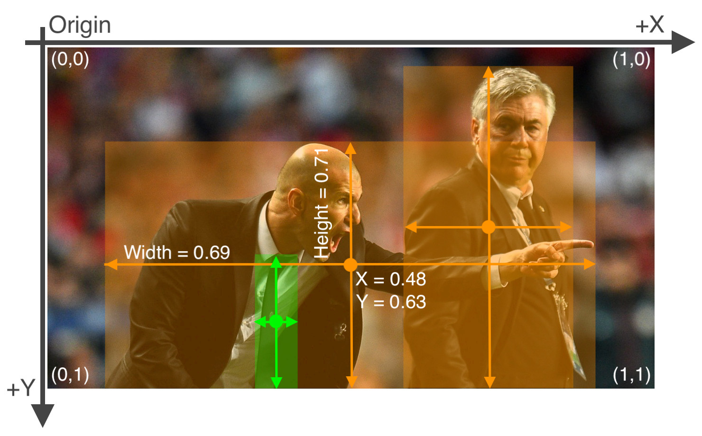

YOLO data format
---
|Projekt CD34|Data        |Osoba       |
|------------|------------|------------|
|Utworzono   |12.08.25    |msokol      |
|Aktualizacja|12.08.25    |msokol      |

## Drzewo folderów
```bash
dataset/
├───train/
│   ├───images/
│   └───labels/
├───test/
│   ├───images/
│   └───labels/
└───valid/
    ├───images/
    └───labels/
```
<!-- 
```bash
dataset/
├───labels/
│   ├───train/
│   └───test/
├───images/
│   ├───train/
│   └───test/
└───annotations/
``` -->

## Pliki adnotacji

- Format pliku to `txt`
- Każdy plik odpowiada jednemu obrazowi w folderze `images`
- Każda linijka odpowiada jednej adnotacji `bounding box`
- ID klasy to `int`, pozostałe wartości są zmiennoprzecinkowe w zakresie <0, 1>
- x_center, y_center, width, height - muszą być znormalizowane



[photo source](https://roboflow.com/formats/yolo)

```html
class_ID<space>x_center<space>y_center<space>width<space>height
```

#### Przykładowy plik `CD34\labels\train\000000000001.txt`
```bash
72 0.773420 0.567570 0.390943 0.556297
69 0.227264 0.632586 0.298491 0.361797
```

## Pliki obrazów
- Pliki `jpg` lub `png` powinny znaleźć się w folderze `images`
- Ścieżki do obrazów powinny znaleźć się w plikach `txt` w folderze bazowym zbioru danych

#### Przykładowy plik `train-cd34.txt`
```yml
./images/train/000000000001.png
./images/train/000000000016.png
./images/train/000000000057.png
./images/train/000000000069.png
./images/train/000000000080.png
```

## Plik YAML ze ścieżkami
- Przykład ze zbioru danych COCO
```yml
# Train/val/test sets as 1) dir: path/to/imgs, 2) file: path/to/imgs.txt, or 3) list: [path/to/imgs1, path/to/imgs2, ..]
path: coco # dataset root dir
train: train2017.txt # train images (relative to 'path') 118287 images
val: val2017.txt # val images (relative to 'path') 5000 images
test: test-dev2017.txt # 20288 of 40670 images, submit to https://competitions.codalab.org/competitions/20794

# Classes
names:
  0: person
  1: bicycle
  2: car
  3: motorcycle
  4: airplane
  5: bus
```

- Analogicznie mamy
```yml
# CD34/dataset.yaml
path: CD34

train: train-cd34.txt
val: valid-cd34.txt
test: test-cd34.txt

names:
  0: Megakariocyty
  1: Mieloblasty
  2: Komórki
```


## Yolo detect
[dokumentacja ultralytics](https://docs.ultralytics.com/usage/python/)
```python
from ultralytics import YOLO

# Create a new YOLO model from scratch
model = YOLO("yolo11n.yaml")

# Load a pretrained YOLO model (recommended for training)
model = YOLO("yolo11n.pt")

# Train the model using the 'coco8.yaml' dataset for 3 epochs
results = model.train(data="dataset.yaml", epochs=3)

# Evaluate the model's performance on the validation set
results = model.val()

# Perform object detection on an image using the model
results = model("https://ultralytics.com/images/bus.jpg")
```

